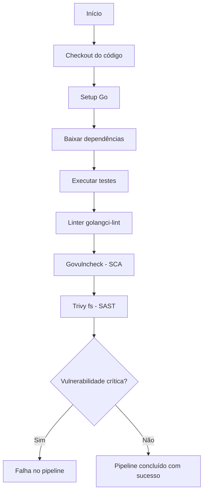
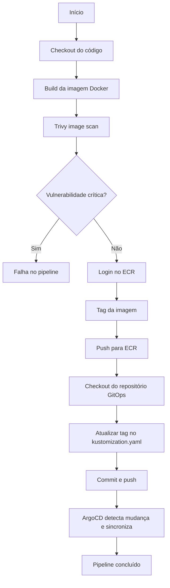
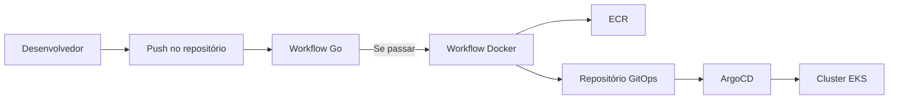

Workflows de CI/CD

Este documento resume o funcionamento dos workflows do GitHub Actions utilizados no projeto ToggleMaster. Os diagramas abaixo ilustram o fluxo de cada pipeline reutilizável.

---

## Repositórios no Amazon ECR

Todos os repositórios de imagens Docker no ECR seguem o padrão:

`togglemaster-<nome-do-servico>`

Exemplos:
- togglemaster-auth
- togglemaster-flag
- togglemaster-targeting
- togglemaster-evaluation
- togglemaster-analytics

Esse prefixo é fixo e deve ser usado em todos os pipelines que fazem push para o ECR.

---

## Workflow Go (reutilizável)

O arquivo `go-package.yml` é utilizado para testar, analisar e escanear o código Go de cada microsserviço.

### Diagrama do fluxo

### Etapas

1. **Build e testes** – baixa as dependências e executa `go test`.
2. **Linter** – executa `golangci-lint` para verificar qualidade do código.
3. **Escaneamento de segurança** – duas ferramentas são executadas:
   - `govulncheck` – verifica vulnerabilidades conhecidas nas dependências e na stdlib. Apenas gera relatório; não bloqueia o pipeline.
   - `Trivy (modo fs)` – escaneia o código fonte e as dependências. Bloqueia o pipeline se encontrar vulnerabilidades de severidade **CRÍTICA**.

Essa abordagem garante que o pipeline só falhe quando houver uma vulnerabilidade crítica, cumprindo o requisito de DevSecOps.

---

## Workflow Docker (reutilizável)

O arquivo `docker-pipeline.yml` é chamado por cada microsserviço para construir a imagem, escanear vulnerabilidades e publicar no ECR.

### Diagrama do fluxo

### Como funciona

1. **Build da imagem** – a imagem é construída com a tag `latest` e depois renomeada com o nome do repositório ECR.
2. **Escaneamento de segurança** – o Trivy verifica a imagem em busca de vulnerabilidades críticas. Se encontrar alguma, o pipeline falha.
3. **Login no ECR** – as credenciais da AWS são configuradas e o login é realizado.
4. **Push** – a imagem é enviada para o ECR com a tag do commit SHA.
5. **Atualização do GitOps** – após o push, o workflow atualiza automaticamente o repositório `togglemaster-deploy`, alterando a tag da imagem no arquivo `kustomization.yaml` do serviço correspondente. O ArgoCD então sincroniza a nova versão no cluster.

---

## Visão geral da integração

O diagrama abaixo mostra como os workflows se integram com a infraestrutura e o GitOps.

### Dependência entre os workflows

A ordem de execução recomendada é:

1. **Terraform** – provisiona a infraestrutura (ECR, RDS, Redis, EKS, etc.).
2. **Go workflow** – valida e escaneia o código de cada serviço.
3. **Docker workflow** – constrói e publica as imagens, atualizando o GitOps.

Essa sequência garante que os repositórios ECR existam antes do push das imagens e que o código esteja seguro antes da publicação.

---

## Observações finais

- Todas as imagens são versionadas com o commit SHA, o que facilita rastrear qual versão está em cada ambiente.
- A atualização do GitOps é automática, eliminando a necessidade de comandos manuais de `kubectl`.
- O ArgoCD, configurado no cluster, monitora o repositório `togglemaster-deploy` e aplica as mudanças automaticamente.
