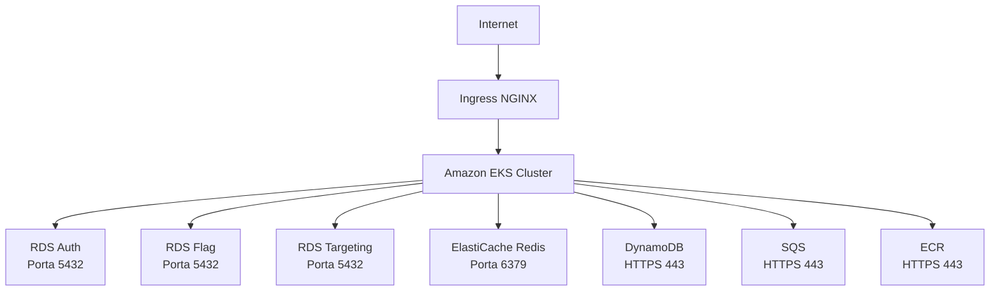
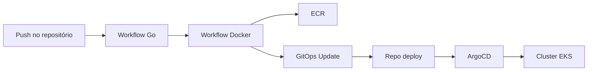

# ToggleMaster


ToggleMaster é um sistema de gerenciamento de feature flags baseado em microsserviços. O projeto permite o controle dinâmico da liberação de funcionalidades em aplicações, gerenciando regras de segmentação de usuários e a avaliação de flags.


---

## Índice

- [Visão Geral](#visão-geral)
- [Tecnologias](#tecnologias)
- [Arquitetura de Nuvem](#arquitetura-de-nuvem)
- [Pré-requisitos](#pré-requisitos)
- [Secrets Necessárias](#secrets-necessárias)
- [Estrutura do Repositório](#estrutura-do-repositório)
- [Infraestrutura como Código (Terraform)](#infraestrutura-como-código-terraform)
- [CI/CD com GitHub Actions](#cicd-com-github-actions)
- [GitOps com ArgoCD](#gitops-com-argocd)
- [Segurança](#segurança)
- [Desafios e Soluções](#desafios-e-soluções)
- [Construção Local com Docker](#construção-local-com-docker)

---

## Visão Geral

O ToggleMaster é composto por 5 microsserviços:

- **Auth Service** – Autenticação e autorização de usuários.
- **Flag Service** – Gerenciamento de feature flags (criação, atualização, exclusão).
- **Targeting Service** – Definição e validação de regras de segmentação.
- **Evaluation Service** – Avaliação de flags para usuários específicos.
- **Analytics Service** – Coleta e processamento de eventos de avaliação.

Todos os serviços são implantados em um cluster Kubernetes (EKS) e se comunicam com bancos de dados e serviços gerenciados na AWS.

---

## Tecnologias

| Área | Tecnologias |
|------|-------------|
| Linguagens | Go, Python |
| Orquestração | Kubernetes, Docker |
| Infraestrutura | Terraform, AWS (EKS, RDS, ElastiCache, DynamoDB, SQS, ECR) |
| CI/CD | GitHub Actions (workflows reutilizáveis) |
| GitOps | ArgoCD |
| Segurança | Trivy, Govulncheck, Golangci-lint, SSM Parameter Store + KMS |

---

## Arquitetura de Nuvem

### Componentes

- **Amazon EKS** – Cluster Kubernetes para os microsserviços.
- **Amazon RDS PostgreSQL** – 3 instâncias (Auth, Flag, Targeting).
- **Amazon ElastiCache Redis** – Cache para avaliação de flags.
- **Amazon DynamoDB** – Armazenamento de eventos de analytics.
- **Amazon SQS** – Fila para processamento assíncrono de eventos.
- **Amazon ECR** – Repositório de imagens Docker.

### Fluxo de Comunicação



### Security Groups

As regras de Security Group permitem a comunicação entre os componentes:

| Origem | Destino | Porta | Protocolo |
|--------|---------|-------|-----------|
| EKS Node Group | RDS | 5432 | TCP |
| EKS Node Group | ElastiCache Redis | 6379 | TCP |
| EKS Node Group | DynamoDB | 443 | HTTPS |
| EKS Node Group | SQS | 443 | HTTPS |
| EKS Node Group | ECR | 443 | HTTPS |

> Não há acesso público direto às instâncias RDS ou Redis. A comunicação com serviços AWS gerenciados ocorre via HTTPS utilizando as APIs da AWS.

---

## Pré-requisitos

- **Docker** ou **Podman** com plugin Compose instalado.
- **Terraform** versão 1.5 ou superior.
- **AWS CLI** instalado e configurado (com acesso ao AWS Academy Learner Lab).
- **kubectl** versão 1.31 ou superior.
- Utilitários Linux: `bash`, `base64`, `jq`, `psql`.

---

## Secrets Necessárias

Para que os workflows do GitHub Actions funcionem corretamente, você precisa configurar os seguintes **Organization Secrets** (ou Repository Secrets) no GitHub:

| Nome do Secret | Descrição | Onde é usado |
|----------------|-----------|--------------|
| `AWS_ACCESS_KEY_ID` | Chave de acesso AWS | Todos os workflows (Terraform, Docker, Go) |
| `AWS_SECRET_ACCESS_KEY` | Chave secreta AWS | Todos os workflows |
| `AWS_SESSION_TOKEN` | Token de sessão (obrigatório no AWS Academy) | Todos os workflows |
| `AWS_REGION` | Região AWS (ex: `us-east-1`) | Todos os workflows |
| `DB_USERNAME` | Usuário administrador do PostgreSQL | Terraform (security) |
| `TERRAFORM_STATE_BUCKET` | Nome do bucket S3 para o estado do Terraform | Terraform |
| `PERSONAL_ACCESS_TOKEN` | Token GitHub com permissão `repo` para push no repositório deploy | Workflow GitOps |

> **Importante:** No AWS Academy, o `AWS_SESSION_TOKEN` é obrigatório porque as credenciais são temporárias. Certifique-se de renová-lo sempre que expirar.

Esses secrets devem ser definidos no nível da organização (`devops-tm`) para que todos os repositórios possam acessá-los, ou no nível do repositório se preferir.

---

## Estrutura do Repositório

```
togglemaster-app/
├── .github/
│   └── workflows/
│       ├── go-package.yml           # Workflow reutilizável para Go
│       ├── docker-pipeline.yml      # Workflow reutilizável para Docker
│       ├── reusable-gitops.yml      # Workflow reutilizável para GitOps
│       ├── terraform-apply.yml      # Apply da infraestrutura
│       └── terraform-destroy.yml    # Destroy da infraestrutura
│
├── src/                              # Código fonte dos microsserviços
│   ├── auth-service/
│   ├── flag-service/
│   ├── targeting-service/
│   ├── evaluation-service/
│   └── analytics-service/
│
├── terraform/                        # Infraestrutura como Código
│   ├── environments/prod/
│   │   ├── security/                 # SSM + KMS
│   │   ├── data/                     # RDS + Redis + DynamoDB + SQS
│   │   ├── platform/                 # ECR
│   │   ├── compute/                  # EKS
│   │   └── networking/               # Security Groups
│   └── modules/                      # Módulos reutilizáveis
│
├── scripts/                          # Scripts auxiliares
├── docs/                             # Documentação
└── README.md
```

> Os microsserviços foram movidos para o diretório `app/` para manter a raiz do repositório organizada.

---

## Infraestrutura como Código (Terraform)

A infraestrutura é provisionada com Terraform, utilizando módulos organizados por domínio:

| Módulo | Descrição |
|--------|-----------|
| `security` | KMS Key + SSM Parameter Store (credenciais) |
| `data` | RDS (3 instâncias), ElastiCache Redis, DynamoDB, SQS |
| `platform` | ECR (5 repositórios) |
| `compute` | EKS Cluster + Node Groups |
| `networking` | Security Groups (ingress rules) |

### Como aplicar

```bash
cd terraform/environments/prod/security
terraform init
terraform apply -auto-approve

cd ../data
terraform init
terraform apply -auto-approve

cd ../platform
terraform init
terraform apply -auto-approve

cd ../compute
terraform init
terraform apply -auto-approve

cd ../networking
terraform init
terraform apply -auto-approve
```

### Backend Remoto

O estado do Terraform é armazenado remotamente em um bucket S3, garantindo segurança e rastreabilidade.

---

## CI/CD com GitHub Actions

O projeto utiliza **workflows reutilizáveis** para padronizar os pipelines de cada microsserviço.

### Workflow Go (`go-package.yml`)

- **Build & Test** – `go test`
- **Linter** – `golangci-lint`
- **SCA** – `govulncheck`
- **SAST** – `Trivy fs` (bloqueia se houver vulnerabilidade **CRÍTICA**)

### Workflow Docker (`docker-pipeline.yml`)

- **Build** da imagem Docker
- **Container Scan** – `Trivy image` (bloqueia se houver vulnerabilidade **CRÍTICA**)
- **Push** para Amazon ECR com a tag do commit SHA
- **GitOps Update** – chama o `reusable-gitops.yml`

### Workflow GitOps (`reusable-gitops.yml`)

- Faz checkout do repositório `devops-tm/togglemaster-deploy`
- Atualiza o `kustomization.yaml` do serviço com a nova tag da imagem
- Commita e faz push na branch `deploy`

### Fluxo completo de CI/CD



---

## GitOps com ArgoCD

O ArgoCD está instalado no cluster EKS e monitora o repositório `devops-tm/togglemaster-deploy`.

- **Branch monitorada:** `deploy`
- **Estrutura:** `k8s/base/services/<servico>/kustomization.yaml`
- **Sincronização:** Automática (Auto-Sync)

Quando o workflow GitOps atualiza a tag da imagem no repositório, o ArgoCD detecta a mudança e aplica a nova versão no cluster.

### Estrutura do repositório deploy

```
togglemaster-deploy/
└── k8s/
    ├── base/
    │   ├── configmap.yaml
    │   ├── namespace.yaml
    │   └── services/
    │       ├── auth/
    │       │   ├── deployment.yaml
    │       │   └── kustomization.yaml
    │       ├── flag/
    │       ├── targeting/
    │       ├── evaluation/
    │       └── analytics/
    └── overlays/
        └── prod/
            └── kustomization.yaml
```

---

## Segurança

### Credenciais

- **Armazenamento:** AWS Systems Manager Parameter Store (`SecureString`).
- **Criptografia:** AWS KMS (chave customizada com rotação automática).
- **Acesso:** Os microsserviços leem as credenciais via SSM SDK.

### Pipeline de Segurança (DevSecOps)

- **SCA:** `govulncheck` (dependências e stdlib).
- **SAST:** `Trivy fs` (código fonte).
- **Container Scan:** `Trivy image` (imagem Docker).
- **Regra de bloqueio:** Qualquer vulnerabilidade **CRÍTICA** interrompe o pipeline.

---

## Desafios e Soluções

| Desafio | Solução |
|---------|---------|
| CI local com Jenkins vs GitHub Actions | Adotado GitHub Actions pela integração nativa com o repositório. |
| Vulnerabilidade crítica no `auth-service` | Ajustado Dockerfile para usar base segura e atualizado dependências. |
| Pipelines de microsserviços duplicados | Criados workflows reutilizáveis (`workflow_call`). |
| Reorganização do repositório | Microsserviços movidos para `app/` e estrutura de pastas padronizada. |
| Secrets Manager bloqueado no Academy | Adotado SSM Parameter Store + KMS. |
| Drift no estado Terraform | Workflow de apply com `refresh-only` e importação automática de recursos existentes. |

---


## Construção Local com Docker

Para executar os microsserviços localmente com Docker Compose (ou Podman):

1. Clone o repositório:
   ```bash
   git clone https://github.com/devops-tm/togglemaster-app.git
   cd togglemaster-app
   ```

2. (Opcional) Ajuste as variáveis de ambiente no arquivo `docker-compose.yml`.

3. Execute os serviços:
   ```bash
   docker compose up -d
   ```

4. Verifique o status:
   ```bash
   docker compose ps
   ```

5. Para parar:
   ```bash
   docker compose down
   ```

> **Nota:** A construção local é útil para desenvolvimento e testes. Para produção, as imagens são publicadas no Amazon ECR e implantadas via GitOps.