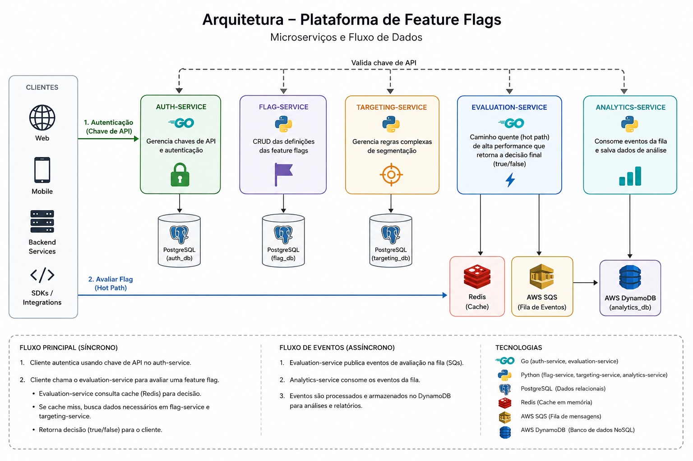

# ToggleMaster



O ToggleMaster e um sistema de gerenciamento de feature flags baseado em microsservicos. O projeto possibilita o controle dinamico da liberacao de funcionalidades em aplicacoes, gerenciando regras de segmentacao de usuarios e a avaliacao de flags.

---

Tecnologias presentes no projeto:
- Python
- Go
- Kubernetes
- Docker
- Terraform
- PostgreSQL
- AWS DynamoDB
- AWS ElastiCache
- AWS SQS

Estrutura de diretorios e referencias:
- [Analytics Service](./analytics-service/)
- [Auth Service](./auth-service/)
- [Evaluation Service](./evaluation-service/)
- [Flag Service](./flag-service/)
- [Targeting Service](./targeting-service/)
- [Kubernetes](./k8s/)
- [Terraform](./terraform/)
- [Scripts Auxiliares](./scripts/)
- [Documentacao](./docs/)

# Construção local via docker

Ecossistema de microsservicos localmente, atraves da orquestracao de contentores, e o provisionamento da primeira camada de nuvem utilizando Terraform. A estrutura foi desenhada respeitando a separacao de responsabilidades e a modularidade da aplicacao.

- Podman ou Docker com o plugin compose instalado nativamente.
- Terraform na versao 1.5 ou superior.
- AWS CLI instalado.
- Acesso ativo ao AWS Academy Learner Lab.
- kubectl (versão 1.31 ou superior)
- utilitários nativos de terminal Linux (bash, base64)
- Psql e jq para testes


# Arquitetura de Nuvem


## Componentes

- Amazon EKS
- Amazon RDS PostgreSQL (3 instâncias)
- Amazon ElastiCache Redis
- Amazon DynamoDB
- Amazon SQS
- Amazon ECR

## Comunicação

O fluxo de comunicação da aplicação é realizado da seguinte forma:

```text
Internet
    │
    ▼
Ingress NGINX
    │
    ▼
Amazon EKS
    │
    ├────────► RDS Auth
    │
    ├────────► RDS Flag
    │
    ├────────► RDS Targeting
    │
    ├────────► ElastiCache Redis
    │
    ├────────► Amazon DynamoDB
    │
    ├────────► Amazon SQS
    │
    └────────► Amazon ECR (pull das imagens)
```

## Security Groups

Para permitir a comunicação entre os componentes foram configuradas regras de Security Group.

### Amazon EKS

O Security Group associado aos Worker Nodes deve possuir acesso de saída para:

- Amazon RDS (TCP 5432)
- Amazon ElastiCache Redis (TCP 6379)
- Amazon DynamoDB (HTTPS 443)
- Amazon SQS (HTTPS 443)
- Amazon ECR (HTTPS 443)


## Acesso Externo

O acesso dos clientes ocorre através do **NGINX Ingress Controller**, publicado como **NodePort**, que encaminha as requisições HTTP para os serviços internos do cluster.

## Observações

- Não há acesso público direto às instâncias RDS.
- Não há acesso público direto ao ElastiCache Redis.
- DynamoDB, SQS e ECR são acessados através das APIs da AWS utilizando HTTPS.
- Toda comunicação entre os microserviços ocorre internamente dentro do cluster Kubernetes.

# Fluxo completo

```text
                    Internet
                        │
                        ▼
               Security Group EKS
                 TCP 32594/31079
                        │
                        ▼
             NGINX Ingress Controller
                        │
        ┌───────────────┼───────────────┐
        ▼               ▼               ▼
   auth-service    flag-service   targeting...
        │               │
        ├───────────────┼───────────────┐
        ▼               ▼               ▼
      RDS           ElastiCache     DynamoDB/SQS
     (5432)           (6379)        (HTTPS 443)
```

# Evolução

- Stack Baseada em Plataforma
- Linter e SAST: SonarCloud
- SCA e Container Scan: Trivy
- Vantagens: Fornece um dashboard web interativo para gerenciar a dívida técnica, acompanhar o histórico de cobertura e visualizar as falhas de segurança de forma centralizada.
- Desvantagens: Requer a criação de uma conta no SonarCloud e a configuração de tokens de integração nos repositórios. O pipeline sofre um acréscimo no tempo total de execução devido à comunicação com a API da plataforma.

# Desafios enfrentados

- Decisão de utilização de SaaS Github Actions ou self-hosted CI com Jenkins

- Código do auth-service/handlers.go identificado a necessidade de tratamento de log para as funções Encode que estavam gerando a quebra na esteira de integração contínua.

- O pipeline do auth-service rodou a etapa de construcao Docker, mas o Trivy identificou uma vulnerabilidade critica no binario compilado, bloqueando a execucao conforme a regra do projeto.

- A esteira do flag-service rodou localmente e foi interrompida na fase de SAST devido a um apontamento estrutural de rede feito pelo Bandit. Resolvido reconfigurando o limite de tolerancia do SAST.

- Identificada a mesma vulnerabilidade de imagem base (Python 3.9) no targeting-service que havíamos resolvido no flag-service. O manifesto do pipeline local foi ajustado com as regras corretas de exceção para o ambiente containerizado.

- Ajuste manual da versao do psycopg2-binary para 2.9.9 nos arquivos de dependencias do flag-service e targeting-service.

- Diagnostico de vulnerabilidades OS-level sem patch disponivel e atualizacao do Dockerfile do evaluation-service.

- O codigo IaC existente para ECR, SQS e DynamoDB foi analisado e os pontos de melhoria foram mapeados com base na arquitetura modular.

- Os fluxos de CI locais foram concluídos e a estrutura modular de IaC via Terraform foi definida seguindo as restrições da AWS Academy.

- uso de pipeline multistage paralelo para otimizacao de tempo.