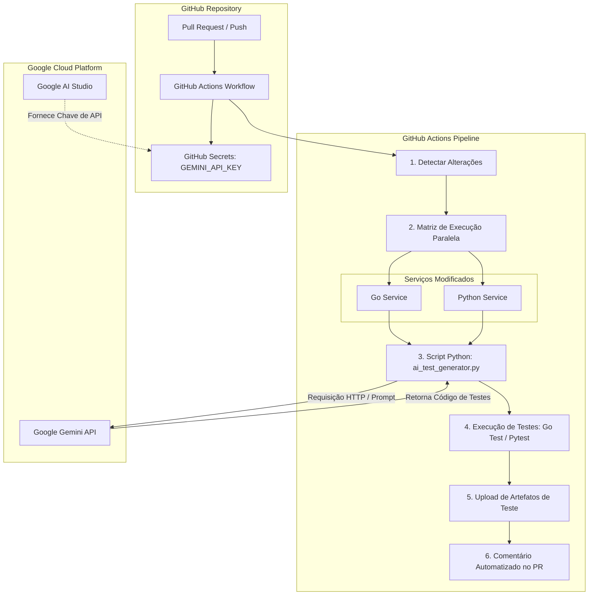
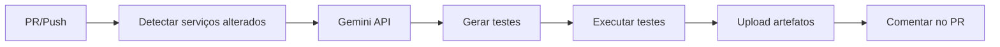

# 🤖 AI Test Generation with Google Gemini

<div align="center">


[](https://ai.google.dev/)
[](https://go.dev/)
[](https://python.org/)
[](https://github.com/features/actions)
[](http://makeapullrequest.com)

</div>

---

## 📋 Visão Geral

Este módulo automatiza a geração de testes unitários para microserviços **Go** e **Python** utilizando a API do **Google Gemini**. O fluxo é acionado em **Pull Requests (PRs)** ou **pushes** na branch `main`, detecta quais serviços foram alterados e gera testes específicos para eles.

---



## 🚀 Fluxo de Trabalho



---

## 🔧 Pré-requisitos

### 1. Chave de API do Google Gemini

Obtenha uma chave gratuita no [Google AI Studio](https://aistudio.google.com/):

1. Acesse [aistudio.google.com](https://aistudio.google.com/).
2. Clique em **"Get API Key"**.
3. Associa a um projeto Google Cloud (não exige cartão de crédito no tier gratuito).
4. Copie a chave (ex: `AIzaSy...`).

### 2. Configurar no GitHub

Adicione a chave como **secret** no repositório ou organização:

- Acesse: `Settings` → `Secrets and variables` → `Actions`.
- Crie um novo secret:
  - Nome: `GEMINI_API_KEY`
  - Valor: cole a chave obtida.

---

## 📂 Estrutura de Diretórios

```
.
├── scripts/
│   └── ai_test_generator.py          # Script principal de geração
├── .github/
│   └── workflows/
│       └── ai-test-generation.yml    # Workflow do GitHub Actions
├── src/
│   ├── auth-service/                 # Serviços Go/Python
│   │   ├── main.go / app.py
│   │   └── ...
│   ├── flag-service/
│   ├── targeting-service/
│   ├── evaluation-service/
│   └── analytics-service/            # Python (analytics)
└── tests/                            # Testes gerados (criados no CI)
    ├── test_auth_generated.go
    ├── test_flag_generated.py
    └── ...
```

---

## 🧠 Script `ai_test_generator.py`

### Propósito

O script lê um arquivo fonte, detecta a linguagem (Go ou Python), envia o código para o Gemini e extrai os testes gerados.

### Uso local (desenvolvimento)

```bash
# Instalar dependências
pip install google-genai

# Gerar testes para um serviço Go
python scripts/ai_test_generator.py src/auth-service/main.go -o tests/test_auth_generated

# Gerar testes para um serviço Python (com pytest)
python scripts/ai_test_generator.py src/analytics-service/app.py -o tests/test_analytics_generated -f pytest

# Forçar linguagem manualmente
python scripts/ai_test_generator.py src/flag-service/main.go --lang go
```

### Argumentos

| Argumento | Descrição | Obrigatório |
|-----------|-----------|-------------|
| `source` | Caminho do arquivo fonte | ✅ Sim |
| `-o, --output` | Nome base do arquivo de saída | ❌ Não |
| `-f, --framework` | Framework Python: `pytest` (padrão) ou `unittest` | ❌ Não |
| `--lang` | Forçar linguagem: `go`, `python` ou `auto` (padrão) | ❌ Não |

### Retry automático

O script possui **5 tentativas automáticas** com **backoff exponencial** (1s, 2s, 4s, 8s, 16s) para erros da API:
- `503 UNAVAILABLE` (sobrecarga)
- `500 Internal Error`

---

## ⚙️ Workflow `ai-test-generation.yml`

### Gatilhos (Triggers)

| Evento | Quando |
|--------|--------|
| `pull_request` | `opened`, `synchronize`, `reopened` |
| `push` | Para a branch `main` |
| `workflow_dispatch` | Manual (útil para testes) |

### Permissões

```yaml
permissions:
  contents: write
  pull-requests: write
  actions: read
```

### Jobs

#### 1. `detect-changes`

- Usa `dorny/paths-filter@v3` para verificar quais serviços foram alterados.
- Filtros: `src/<servico>-service/**`.
- Saída: JSON com os serviços modificados (ex: `["auth", "flag"]`).

#### 2. `generate-tests` (matrix)

- **Roda em paralelo** para cada serviço alterado.
- **Configura** Python e Go (se necessário).
- **Instala** `google-genai`.
- **Encontra** o arquivo principal (`main.go`, `app.py`, etc.).
- **Gera** os testes com o script.
- **Executa** os testes com acesso ao código fonte real.
- **Envia** os testes como artefato (`tests-<servico>`).

#### 3. `comment-pr`

- **Baixa** todos os artefatos.
- **Gera** um sumário dos testes gerados.
- **Cria/atualiza** um comentário no PR com o resumo.

---

## 🧪 Execução dos Testes

### Go

O workflow:
1. Copia o diretório do serviço para `/tmp/go-test-run`.
2. Copia o arquivo de teste gerado para dentro.
3. Executa `go test -v ./...`.

### Python

O workflow:
1. Copia o diretório do serviço para `/tmp/py-test-run`.
2. Copia o arquivo de teste gerado.
3. Instala `pytest` e `pytest-cov`.
4. Executa `pytest -v`.

> ⚠️ **Os testes são gerados por IA e podem conter erros.** O pipeline não falha se os testes falharem – apenas exibe um aviso. O artefato fica disponível para revisão manual.

---

## 📊 Exemplo de Comentário no PR

```markdown
## 🤖 AI Test Generation (Gemini)

**Serviços modificados:** ["auth", "flag"]

- **auth** (.go): ✅ Testes gerados (127 linhas)
- **flag** (.go): ✅ Testes gerados (98 linhas)

> ⚠️ **Os testes foram gerados por IA e podem conter erros. Revise antes de mesclar.**
```

---

## 🔍 Como Revisar os Testes Gerados

1. Acesse a **página do workflow** no GitHub Actions.
2. Na seção **Artifacts**, baixe o arquivo `tests-<servico>.zip`.
3. Extraia e revise o arquivo `test_<servico>_generated.<ext>`.

---

## 🐛 Solução de Problemas (Troubleshooting)

| Problema | Causa | Solução |
|----------|-------|---------|
| Erro `503 UNAVAILABLE` | API do Gemini sobrecarregada | O script já possui retry automático. Aguarde e reexecute. |
| `undefined: App` no Go | Teste gerado depende de tipos reais | O workflow executa com o código fonte, resolvendo esse erro. |
| Nenhum teste gerado | API não respondeu ou prompt falhou | Verifique a chave `GEMINI_API_KEY` e os limites de cota. |
| Erro `pip install google-genai` | Dependência não encontrada | Verifique a versão do Python (3.11+ recomendado). |

---
