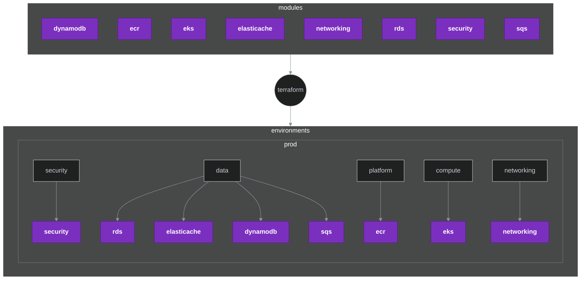
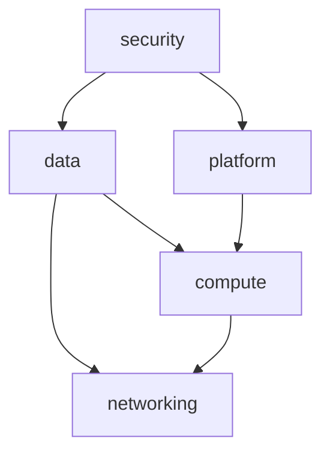

# Terraform

# Terraform - Infraestrutura como Código


Este repositório contém toda a definição da infraestrutura da ToggleMaster na AWS, utilizando **Terraform** com módulos reutilizáveis e separação por ambientes.

---

## Estrutura de Diretórios



---

## Dependência entre Módulos

O fluxo de provisionamento segue uma ordem específica para garantir que os recursos sejam criados na sequência correta.



| Módulo | Depende de | Cria |
|--------|------------|------|
| security | - | SSM Parameters, senhas aleatórias |
| data | security | RDS, Redis, DynamoDB, SQS |
| platform | - | Repositórios ECR |
| compute | platform (opcional) | Cluster EKS + Node Groups |
| networking | data, compute | Regras de segurança (ingress) |

---

## Resumo dos Módulos

| Módulo | Descrição | Principais Recursos |
|--------|-----------|----------------------|
| **security** | Geração e armazenamento de credenciais | `random_password`, `aws_ssm_parameter` |
| **rds** | Instâncias PostgreSQL | `aws_db_instance`, `aws_security_group` |
| **elasticache** | Cluster Redis | `aws_elasticache_cluster`, `aws_elasticache_subnet_group` |
| **dynamodb** | Tabela para analytics | `aws_dynamodb_table` |
| **sqs** | Fila de mensagens | `aws_sqs_queue` |
| **ecr** | Repositórios de imagens Docker | `aws_ecr_repository` |
| **eks** | Cluster Kubernetes | `aws_eks_cluster`, `aws_eks_node_group` |
| **networking** | Regras de segurança entre serviços | `aws_vpc_security_group_ingress_rule` |

---

## Remote State

Todos os estados são armazenados remotamente em um **bucket S3**, com chaves distintas por ambiente e módulo:

```
prod/security/terraform.tfstate
prod/data/terraform.tfstate
prod/platform/terraform.tfstate
prod/compute/terraform.tfstate
prod/networking/terraform.tfstate
```

Isso garante isolamento entre camadas e facilita o trabalho em equipe.

---

## Como Usar

### 1. Inicializar um módulo
```bash
cd environments/prod/<modulo>
terraform init -reconfigure
```

### 2. Planejar mudanças
```bash
terraform plan -var-file="terraform.tfvars"
```

### 3. Aplicar
```bash
terraform apply -var-file="terraform.tfvars" -auto-approve
```

### 4. Destruir (cuidado!)
```bash
terraform destroy -var-file="terraform.tfvars" -auto-approve
```

---

## Observações Importantes

- As senhas são geradas aleatoriamente pelo módulo `security` e armazenadas no **SSM Parameter Store** como `SecureString`.
- O módulo `data` lê as credenciais via `data.aws_ssm_parameter`, evitando exposição no estado.
- O módulo `networking` só cria regras de segurança se o security group do EKS for fornecido; no destroy, se o valor for vazio, nenhuma regra é criada, permitindo a remoção sem dependências.
- No ambiente AWS Academy, o EKS utiliza a `LabRole` existente (não cria roles IAM).

---

